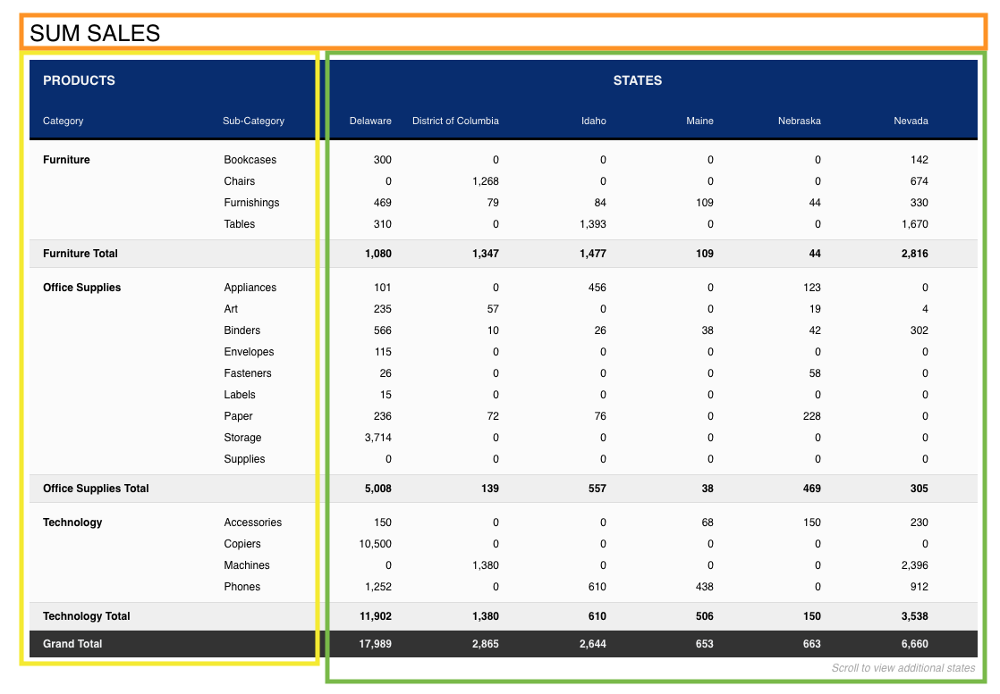

### Overview

The purpose of this challenge was to create a mockup of office supply sales data in a pivot table format. Use of the [Create React App](https://github.com/facebook/create-react-app) was a requirement and no external libraries were permitted.

### Installation

1.  Check that Node and NPM are installed. Run `node -v` and then `npm -v` from the command line (Windows) or Terminal app (Mac). If a version number does not print to the console, follow [Mac](http://blog.teamtreehouse.com/install-node-js-npm-mac) or [Windows](http://blog.teamtreehouse.com/install-node-js-npm-windows) installation instructions.

2.  Open the ZIP file, install dependencies, then navigate to the project's root directory to start the development server (from the command line or Terminal app). Commands are as follows:

  ```
    > cd pivot-table
    > npm install
    > npm start
  ```

_Access to the private Github repository used for this challenge is available upon request_

3.  Follow terminal instructions the view the app locally in your browser of choice (the message "Compiled successfully!" should appear along with instructions to view the app at http://localhost:3000). This app was optimized for Chrome, Safari and Firefox only. Note: Running `npm start` and entering the keyboard shortcut `CTRL + C` from the project's root directory will start and stop the server.

### Architecture

Major components are outlined with different border colors in the image below. Each state (Delaware, Maine, etc.) is an object and was rendered as an individual column within its component.

<p align='center'>
  
</p>

### Approach

Given the code challenge was a non-production-ready proof of concept, the following simplifications were made:

1. The sample data set contained too much data for one API call to populate the entire table at once in a production environment. In the absence of a controlled flow of data, or a middleware/back end solution that could process some of the data before sending it to the front end, a smaller sample set was created based on the original data set (about 15,000 lines vs. 113,000 lines of code). An additional data file was also created to emulate an API call and get high level category/subcategory groupings.

2. The data needed to be refactored to create easier groupings for rendering data by geographical state in the browser. Select states were chosen and data was manually regrouped. Not all geographical states were refactored because the cost of time spent wouldn't have outweighed the benefit in solving this code challenge.

3. The sale prices in the sample JSON did not consistently have 2 numbers after the decimal point (and sometimes there were three). This inconsistency coupled with JavaScript's rounding methods caused subtotals and grand totals to be too low or too high when displaying whole numbers in the UI (as displayed in the provided wireframe). The two solutions were (1) manually update every JSON object with two decimals for consistency (which might not be favorable in a real-life scenario) or (2) display sale prices with three decimal points to the user. I chose the latter since it was more pertinent in this coding challenge to prove the addition was correct.

Additional considerations if the app was intended for production:

1. Optimize page layout for both desktop and mobile browsers
2. Better align code with [W3C accessibility standards](https://www.w3.org/standards/webdesign/accessibility)
3. Follow company branding guidelines regarding use of colors, fonts, logos, etc.
4. Partner with DevOps and/or security specialists to pinpoint any security issues or vulnerabilities (such as restricting access to content based on a user's permission level, or by country in which the data is accessed, etc.)

### Next Steps
1. Create a menu of controls in the UI to filter and manipulate data (similar to a pivot table menu in Excel)
2. Incorporate Redux to control the flow of data when filter selection changes are prompted by the user
3. Refactor code for scalability with varying data sets, and add TypeScript
